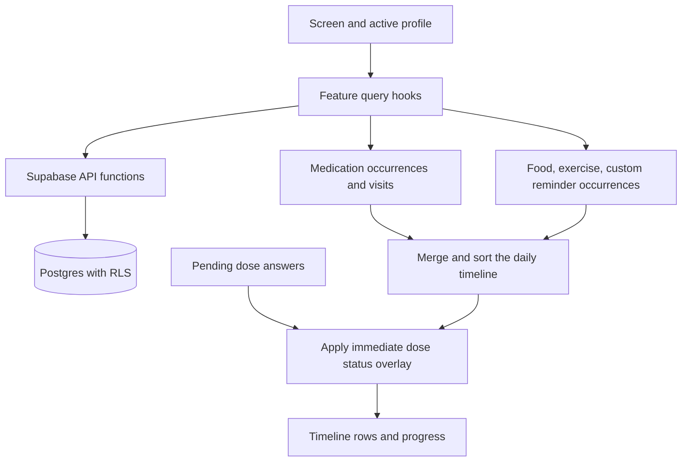

# Architecture

Last reviewed against the repository: **2026-09-28**. See [Setup](SETUP.md) to run the app and [Production readiness](PRODUCTION_READINESS.md) for release gates.

## Structure

```text
app/                         Expo Router routes
  _layout.tsx                Providers, root stack, auth cleanup, notification actions
  index.tsx                  Session check → login or tabs
  login.tsx                  Email/password sign-in and sign-up
  onboarding/index.tsx       Welcome and first-medication action
  (tabs)/
    _layout.tsx              Tab navigation, reminder sync, dose queue sync
    index.tsx                Unified daily calendar
    medications.tsx          Active and completed/stopped medications
    appointments.tsx         Upcoming and past visits
    lifestyle.tsx            Food and exercise logs by day
    profile.tsx              Family profiles and account navigation
  medication/                New, detail, edit/[id]
  appointment/               New, detail, edit/[id]
  food/                      New and [id] edit form
  exercise/                  New and [id] edit form
  guardian/                  New and [id] edit form
  reminder/                  New and [id] edit form
  guardians.tsx              Guardian contact list
  reminders.tsx              Custom reminder list
  settings.tsx               Preferences, sign-out, account deletion
  paywall.tsx                Unavailable message for legacy Premium deep links
src/
  components/                Shared controls and domain UI
  features/                  APIs, hooks, forms, and pure feature logic
  i18n/                      Typed English/Urdu messages and formatters
  lib/                       Supabase, recurrence, dates, errors, web alerts
  theme/                     Colors, typography, spacing, motion, providers
  types/                     Database and application types
supabase/migrations/         Six ordered SQL migrations
tests/                      Six TypeScript logic test files
scripts/generate-icons.mjs   SVG-to-PNG app icon generation
```

There is no separate application server, subscription module, analytics integration, or global state store directory. The app calls Supabase directly. SQL triggers and an account-deletion function provide the backend behavior stored in this repository.

## Startup and state

`app/_layout.tsx` installs the web Alert adapter and wraps navigation in gesture/safe-area, preferences, locale, theme, persisted React Query, auth-session, and active-profile providers. Preferences load before children render. The root stack protects private routes from unauthenticated navigation, including direct links and expired sessions. Supabase policies enforce database ownership; client route protection is a presentation guard.

After sign-up with a session, login opens onboarding. With confirmation required and no session, it displays a check-email message. Email links return through `auth/callback`, which handles session tokens, authorization codes, and OTP hashes. Recovery links open a password form. The database sign-up trigger creates the account's self profile. The redirect allowlist, email templates, and delivery need deployment testing.

State has three main homes:

- React Query: server records and derived calendar results.
- React context: active profile, preferences, locale, and theme.
- Component state: selected dates, form inputs, and presentation controls.

The active profile defaults to the self profile and can be switched on Profile. Selection is in memory and falls back to self when the selected ID is absent. Notifications query records across all profiles owned by the account, independent of the profile currently displayed.

## Feature modules

| Module under `src/features/` | Responsibility |
|---|---|
| `profile` | List profiles, add dependents, select the active profile |
| `medications` | Medication CRUD, course windows, dose records, refill estimates, schedule replacement |
| `appointments` | Visit CRUD and post-visit notes |
| `calendar` | Medication/visit daily events and month summaries |
| `nutrition`, `exercise` | Log CRUD, validation helpers, recent foods, duration summaries |
| `lifestyle` | Merge additional events into the timeline and build month markers |
| `reminders` | Custom reminder CRUD, repeating occurrences, completion toggles |
| `guardians` | Contacts, phone normalization, missed-dose message composition |
| `notifications` | Pure notification planning, native scheduling, action handling, sync |
| `offline` | Persistent edit journal and fetched snapshots, plus the separate dose outbox and retries |
| `preferences` | Persist follow-ups, Simple Mode, and language choice |

Most features separate Supabase row mapping in `api.ts`, React Query hooks in `use*.ts`, reusable forms, and pure helpers. Database columns use snake_case; domain objects use camelCase. `src/types/database.ts` is maintained by hand; migrations are the schema source of truth.

## Calendar and query flow



`useCalendarEvents` fetches medications, visits, and dose answers for a range. `dosesInRange` derives scheduled doses and matches saved answers by epoch time, avoiding differences between Postgres `+00:00` and JavaScript `Z` timestamps. Food, exercise, and custom reminders load separately before `mergeTimeline` combines them on Home.

`MonthCalendar` uses flash-calendar date math and custom day cells. It shows a month grid or one week with markers; selecting a day controls the timeline below. It is not a multi-day time-column agenda. Month dose/visit summaries use a separate query under `calendarEvents`; lifestyle/reminder markers use `useMonthLogs`.

Record mutations persist ordered edits before reporting local success, then invalidate their query families. Reads overlay those edits on fetched device snapshots, so pending changes survive a restart and appear without a network response. Custom completion toggles also update the loaded completion queries immediately. The dose queue remains separate and overlays pending answers on calendar rows.

## Persistence and notification lifecycle

Successful `profiles`, `medications`, `appointments`, `calendarEvents`, `customReminders`, `foodEntries`, `exerciseEntries`, and `guardians` queries are persisted for up to three days. Fetched row snapshots are stored separately for offline edits. Neither store contains records or calendar days the app has never fetched.

`useDoseSync` and `useReminderSync` mount in the tab layout. `useEditSync` mounts at the root and retries queued edits at startup, on foreground, and every 20 seconds while JavaScript is active. Dose sync retries its own queue; reminder sync builds and applies notification plans when data/settings change and on foreground. `useNotificationActions` handles response events and the last response at launch. There is no registered headless notification task or background schedule-refresh service.

On `SIGNED_OUT`, the root listener clears React Query, persisted query data, record snapshots, both outboxes, and pending notifications. Device preferences remain. See [Reliability](RELIABILITY.md) for limits and unresolved lifecycle cases.

## Interface and localization

Shared components include `AppText`, `AppInput`, `AppButton`, `AppCard`, `TimelineItem`, `MedicationRow`, `VisitCard`, `DatePanel`, `TimePanel`, and loading/error/empty states. New screens should use these and the theme tokens rather than introduce a second visual system.

The palette uses warm neutrals and an orange accent, with distinct event colors. `ThemeProvider` selects a palette from `useColorScheme`, but native app configuration pins `userInterfaceStyle` to `light`; a supported dark-mode release still needs configuration and visual testing. Some layout sizes remain defined in components.

Simple Mode scales theme text by 1.25, enlarges selected controls, starts the calendar collapsed, and hides the Lifestyle tab and Home quick-add icons. It does not delete lifestyle records. Urdu adds line-height spacing and removes letter spacing in `AppText`. See [Languages](LANGUAGES.md).

The icon generator has its own `ORANGE` constant; it does not import the theme. If changing the brand color, update the generator and relevant `app.json` colors as well as the theme, then regenerate assets.

## Verification scope

The 113 logic tests cover scheduling, date handling, timeline merging, both queue behaviors, auth-link parsing, notification payloads/plans, guardian messages, and translations. Playwright runs ten rendered workflow scenarios at phone and desktop widths, using intercepted Supabase responses; see [Functional and UI audit](FUNCTIONAL_UI_AUDIT.md). Live database policies, deployment state, and device notification delivery were not checked.
