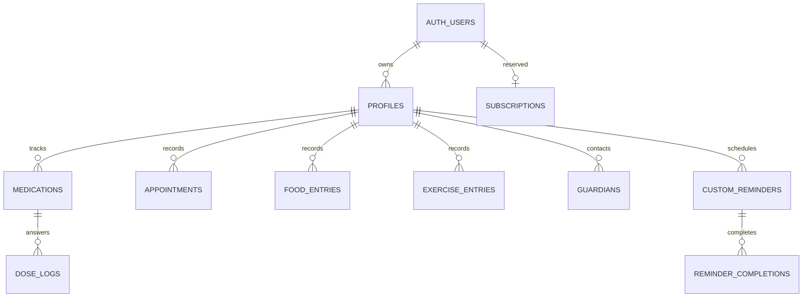

# Data model

Last reviewed: **2026-09-27**. The SQL files in [supabase/migrations](../supabase/migrations) define the schema; [database.ts](../src/types/database.ts) is a hand-maintained TypeScript representation. This document describes the repository, not the verified state of a remote database.

## Ownership and relationships

All public tables enable Row Level Security. Profile policies check `owner_id = auth.uid()`; child records check ownership through their profile or parent record. Normal users can read their own subscription row but cannot write it. Legacy `reminders` has select/insert/delete policies through its source, with no update policy.

Ownership foreign keys cascade on deletion, except the reserved `guardians.linked_user_id`, which becomes null when its referenced auth user is deleted. Legacy `reminders.source_id` has no foreign key and is handled explicitly by account deletion.

## Migration inventory

| Migration | Main behavior |
|---|---|
| `0001_init.sql` | Core tables, policies, self-profile sign-up trigger |
| `0002_delete_account.sql` | `delete_my_account()` RPC |
| `0003_nutrition_exercise.sql` | Food/exercise logs and shared `set_updated_at()` trigger function |
| `0004_guardians.sql` | Guardian contacts and insert limit |
| `0005_refill_countdown.sql` | Adjust quantity on dose insert/status change |
| `0006_custom_reminders.sql` | Custom reminders and occurrence completions |

Apply missing migrations in order; ordinary table/trigger creation statements are not universally idempotent. See [Setup](SETUP.md).

## Profiles

One person per row. The sign-up trigger creates a self profile, using auth metadata `display_name` or `Me`. The current sign-up UI does not collect that name; dependent creation collects a name only.

| Column | Type | Behavior |
|---|---|---|
| `id` | uuid PK | Generated UUID |
| `owner_id` | uuid FK | Required; references `auth.users` |
| `is_self` | boolean | Required, default false |
| `display_name` | text | Required |
| `date_of_birth` | date | Nullable; not exposed by the current add-dependent UI |
| `created_at` | timestamptz | Required, default now |

There is no unique constraint enforcing one self profile per owner, and no current profile edit/delete UI. A dependent does not have a separate login or shared-account permissions.

## Medications

| Column | Type | Behavior |
|---|---|---|
| `id` | uuid PK | Generated UUID |
| `profile_id` | uuid FK | Required; references `profiles` |
| `name`, `dosage` | text | Required; dosage is display text |
| `instructions` | text | Nullable |
| `recurrence_rule` | jsonb | Required; interpreted by the app |
| `quantity_on_hand` | integer | Nullable; null means no supply tracking |
| `refill_threshold` | integer | Nullable; UI/helper default is about three days of doses |
| `start_date` | date | Required, local calendar date |
| `end_date` | date | Nullable; inclusive last treatment day |
| `archived_at` | timestamptz | Nullable; stop timestamp |
| `created_at` | timestamptz | Required, default now |

The form creates 1–4 daily times, starts on the current local date, and supports ongoing or 1–365-day courses. Validation of quantities, duplicate times, and duration is largely in the client; the initial medication table does not enforce those ranges or recurrence JSON structure.

Occurrences begin at the later of local start-day midnight and creation time, and end at the earlier of the course's last local day and the stop timestamp. Changing times creates a new medication and archives the old one. Other editable fields change in place; this is not an immutable audit trail. See [Reliability](RELIABILITY.md#editing-and-history).

## Dose logs

| Column | Type | Behavior |
|---|---|---|
| `id` | uuid PK | Generated UUID |
| `medication_id` | uuid FK | Required; references `medications` |
| `scheduled_at` | timestamptz | Required; identifies the scheduled occurrence |
| `status` | text | `pending`, `taken`, `skipped`, or `snoozed`; default pending |
| `logged_at` | timestamptz | Nullable; when the answer was made |

Unique key: `(medication_id, scheduled_at)`. Dose answers use upsert on that key. The app derives unanswered occurrences as pending placeholders; it does not prepopulate every scheduled dose in this table. Current user actions save taken/skipped. Snoozing schedules a local notification without writing a snoozed log.

Migration `0005` subtracts one tracked supply unit on insert-as-taken or a transition into taken; a transition out of taken adds one. Repeating the same taken upsert does not subtract again. Decrements clamp at zero. There is no dose-log deletion adjustment, inventory ledger, or parsing of dosage text into pill quantities.

## Appointments

Patient-entered visit reminders, with no linked provider identity or booking integration.

| Column | Type | Behavior |
|---|---|---|
| `id` | uuid PK | Generated UUID |
| `profile_id` | uuid FK | Required |
| `provider_name` | text | Required free text |
| `specialty`, `location` | text | Nullable |
| `scheduled_at` | timestamptz | Required, single instant |
| `pre_visit_notes`, `post_visit_notes` | text | Nullable |
| `created_at` | timestamptz | Required, default now |

Visits have no recurrence column. The notification planner derives day-before and hour-before alerts from `scheduled_at`.

## Food entries

Plain meal logs; no calorie, macro, or clinical assessment fields.

| Column | Type | Behavior |
|---|---|---|
| `id` | uuid PK | Generated UUID |
| `profile_id` | uuid FK | Required |
| `name` | text | Required; trimmed length 1–120 |
| `meal_type` | text | `breakfast`, `lunch`, `dinner`, `snack`, `other` |
| `eaten_at` | timestamptz | Required |
| `quantity` | text | Nullable; at most 60 characters |
| `notes` | text | Nullable; at most 1000 characters |
| `created_at`, `updated_at` | timestamptz | Default now; update trigger maintains `updated_at` |

Index: `(profile_id, eaten_at desc)`.

## Exercise entries

| Column | Type | Behavior |
|---|---|---|
| `id` | uuid PK | Generated UUID |
| `profile_id` | uuid FK | Required |
| `exercise_type` | text | `walking`, `running`, `cycling`, `gym`, `strength`, `yoga`, `stretching`, `swimming`, `sports`, `other` |
| `name` | text | Nullable; trimmed length 1–120 when set; required for `other` |
| `started_at` | timestamptz | Required |
| `duration_minutes` | integer | Required; 1–1440 |
| `intensity` | text | Nullable; `light`, `moderate`, `vigorous` |
| `notes` | text | Nullable; at most 1000 characters |
| `created_at`, `updated_at` | timestamptz | Default now; update trigger maintains `updated_at` |

Index: `(profile_id, started_at desc)`. Food/exercise records are logs and do not directly schedule notifications. A user may separately create a custom reminder about either activity; there is no foreign-key link between them.

## Guardians

Contacts entered by the account owner. Storing a guardian does not grant that person data access.

| Column | Type | Behavior |
|---|---|---|
| `id` | uuid PK | Generated UUID |
| `profile_id` | uuid FK | Required |
| `name` | text | Required; trimmed length 1–80 |
| `relationship` | text | Nullable; at most 40 characters |
| `phone` | text | Required; 7–15 digits with an optional leading `+` |
| `notify_on_missed` | boolean | Default true; controls whether the contact is offered for manual messaging |
| `linked_user_id` | uuid FK | Nullable; reserved and unused by current app flows |
| `created_at`, `updated_at` | timestamptz | Default now; update trigger maintains `updated_at` |

Index: `profile_id`. The UI and a before-insert count trigger implement an intended limit of three per profile. The trigger is not a concurrency-safe uniqueness constraint and does not run on profile reassignment. The app does not expose reassignment or linked-account sharing.

## Custom reminders

| Column | Type | Behavior |
|---|---|---|
| `id` | uuid PK | Generated UUID |
| `profile_id` | uuid FK | Required |
| `title` | text | Required; trimmed length 1–120 |
| `notes` | text | Nullable; at most 500 characters |
| `recurrence_rule` | jsonb | Required; shapes below |
| `start_date` | date | Required |
| `end_date` | date | Nullable; database requires it not precede start |
| `created_at`, `updated_at` | timestamptz | Default now; update trigger maintains `updated_at` |

Index: `profile_id`. Repeating reminders use the same creation/start/end window idea as medication schedules. A one-off occurrence uses its own instant, even if that instant is already past.

### Reminder completions

| Column | Type | Behavior |
|---|---|---|
| `reminder_id` | uuid FK | References `custom_reminders` |
| `scheduled_at` | timestamptz | Occurrence instant |
| `completed_at` | timestamptz | Required, default now |

Primary key: `(reminder_id, scheduled_at)`. Completing inserts idempotently; undo deletes the row. Edits to a reminder's recurrence happen in place and do not version its previous schedule or remap old completion timestamps.

## Reserved tables

### Legacy `reminders`

Present since `0001`, but unused by current scheduling. Columns: generated `id` UUID; `source_type` (`medication` or `appointment`); `source_id` UUID; `offset_minutes` integer; `escalation_enabled` boolean default false. All are required.

`source_id` is a polymorphic reference, not an enforced FK. Its escalation field does not enable automatic alerts. New reminder work should start from `custom_reminders` and the current planner rather than assume this table is active.

### `subscriptions`

Reserved for a future trusted billing integration. Columns: `user_id` UUID PK/FK; required `status` (`trial`, `active`, `expired`, `canceled`); nullable `current_period_end`; required `updated_at` default now. Users have read-only access to their own row. No RevenueCat webhook, SDK, or entitlement consumer is implemented.

## Recurrence JSON

The shared engine in [recurrence.ts](../src/lib/recurrence.ts) supports:

| Type | Example | Current creation UI |
|---|---|---|
| `times_per_day` | `{"type":"times_per_day","count":2,"at":["09:00","21:00"]}` | Medications and daily custom reminders |
| `weekdays` | `{"type":"weekdays","days":["mon","fri"],"at":["09:00"]}` | Custom reminders |
| `once` | `{"type":"once","at":"2026-10-01T04:00:00.000Z"}` | Custom reminders |
| `monthly` | `{"type":"monthly","day":31,"at":["09:00"]}` | Custom reminders |
| `every_n_days` | `{"type":"every_n_days","every":3,"from":"2026-10-01","at":["09:00"]}` | Custom reminders |
| `interval_hours` | `{"type":"interval_hours","every":8}` | No current form exposes it |

Daily occurrences use the `at` array; `count` is metadata. The monthly day clamps to the month's last day. Every-N-days uses a local calendar-day anchor. Daily custom reminders allow up to four times; the other repeating form choices keep one time.

The interval-hours implementation starts from the effective query lower bound, not a stored medication anchor. It is not suitable to advertise as a stable cross-query interval schedule without further work. Recurrence JSON has no database shape validation.

## Dates, identity, and deletion

- Date-only values are local calendar dates (`YYYY-MM-DD`), parsed with local helpers.
- Occurrence/visit/log instants are ISO timestamps backed by `timestamptz`; compare epoch times rather than serialized strings.
- No IANA timezone is stored per profile or schedule. Travel/timezone behavior needs device validation.
- `delete_my_account()` requires an authenticated caller, removes their legacy reminder rows, then deletes their auth user. Foreign-key cascades remove owned profiles and child records.
- Account deletion does not define backup retention or erase already sent SMS messages. Those are separate data-handling concerns in [Compliance](COMPLIANCE.md).

There are no provider, clinic, booking, messaging, allergy, or condition tables. Local auth, caches, preferences, and queued dose answers are described in [Reliability](RELIABILITY.md).
